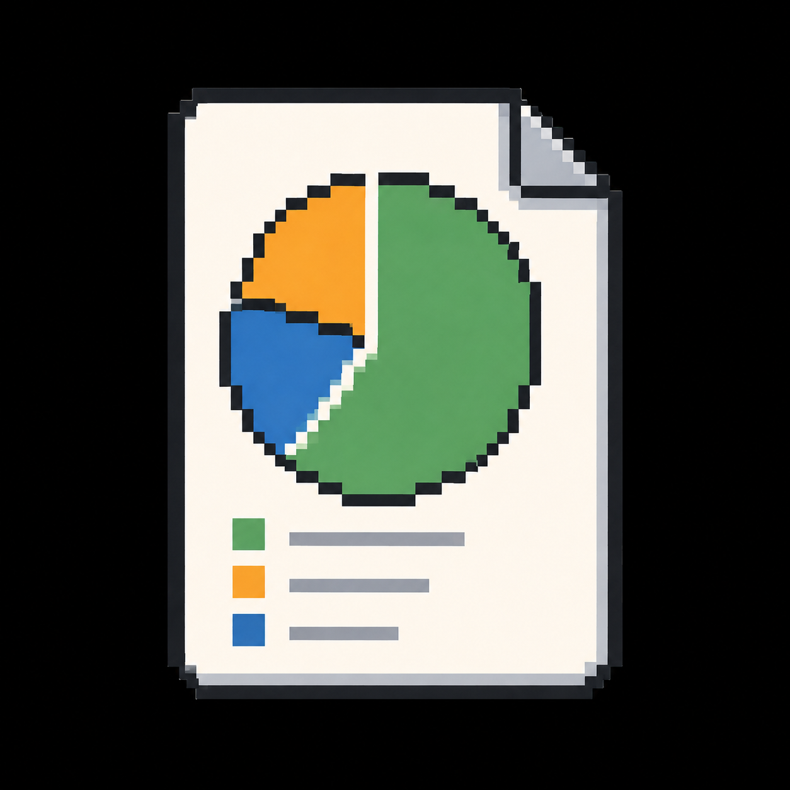

# ChartForge

---

<p align="center">
  
</p>

<p align="center">
  <strong>English</strong> | <a href="README.zh-TW.md">繁體中文</a>
</p>

ChartForge is a fully offline Chrome and Microsoft Edge extension for creating high-resolution charts suitable for presentations.

> ChartForge runs entirely in your browser. It does not use a CDN, external API, remote server, or cloud synchronization.

## Features

---

- Create pie, bar, and line charts
- Customize item names, values, and colors
- Export 16:9, 4:3, and 1:1 images
- Export PNG files at 1x to 4x resolution
- Switch between light, dark, and browser-following themes
- Restore your most recently used settings from local browser storage
- Work completely offline after installation

## Download

---

### Download ZIP

1. Open the repository's **Code** menu.
2. Select **Download ZIP**.
3. Extract the downloaded ZIP file to a permanent location.

> Do not load ChartForge directly from the ZIP archive. Extract it first.

### Clone with Git

If Git is installed, run:

```bash
git clone https://github.com/YOUR_USERNAME/ChartForge.git
cd ChartForge
```

Replace `YOUR_USERNAME` with the actual GitHub username or organization name.

## Install in Your Browser

---

### Google Chrome

1. Open `chrome://extensions/`.
2. Enable **Developer mode**.
3. Select **Load unpacked**.
4. Choose the downloaded or cloned `ChartForge` folder.
5. Make sure the selected folder directly contains `manifest.json`.
6. Optionally pin ChartForge to the browser toolbar.

### Microsoft Edge

1. Open `edge://extensions/`.
2. Enable **Developer mode**.
3. Select **Load unpacked**.
4. Choose the downloaded or cloned `ChartForge` folder.
5. Make sure the selected folder directly contains `manifest.json`.
6. Optionally pin ChartForge to the browser toolbar.

## Update

---

Pull the latest repository changes:

```bash
git pull
```

Then return to `chrome://extensions/` or `edge://extensions/` and select **Reload** on the ChartForge extension card.

## Project Structure

---

```text
ChartForge/
├─ manifest.json
├─ popup.html
├─ popup.css
├─ popup.js
├─ chart.html
├─ chart.css
├─ chart.js
├─ shared.js
├─ lib/
│  └─ echarts.min.js
└─ icons/
   ├─ icon16.png
   ├─ icon32.png
   ├─ icon48.png
   └─ icon128.png
```

ChartForge does not require `npm install`, Vite, a development server, or an internet connection.
